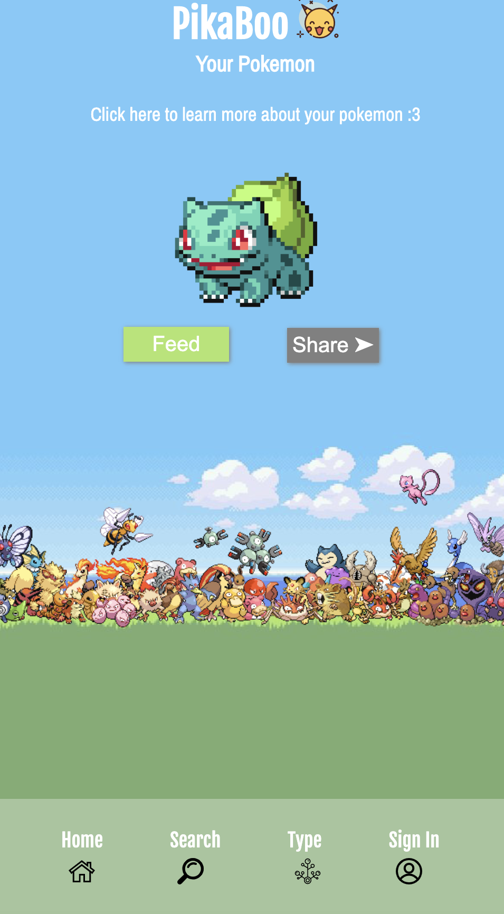

# pikaboo
Pikaboo is a search application that calls Poke API for information about different pokemon, items, and locations.




* Git Manager: Ebony Warren https://github.com/Ebony0wl
* UI Developer: Nisa Cheng https://github.com/NisaCheng
* Server-Side Developer: Mark Calvelo https://github.com/Combatd

This project is licensed under the MIT License, as shown in ```LICENSE.TXT```.
```Copyright (c) [2020] [Ebony Warren] [Mark Calvelo] [Nisa Cheng]```

## Learning Goals
* Implement the Model (API), View, and Controller Software Architecture
* Understand git version control with pull requests, branches, and merge conflicts.
* Draft a Design Document, Wireframe, and a well formatted README.md
* Learn how to import libraries and frameworks using NPM, node_modules, package.json

## Background
During the past few months alot of people around the world have started to reflect on experiences that they use to take for granted. The daily interactions and the small conversations. The friends that they had grown apart from before the pandemic. 

Our Snap Mini seeks to bring back these relationships by using the popular game Pokemon

Since the word for friend in Japanese is Tomodachi we decided to name our snap mini “Poke-Dachi”


### Technologies
* Model-View-Controller Software Architecture (MVC)
* HTML5
* CSS3
* JavaScript
* Firebase (NoSQL Database, User Authorization)
* Node.js
* Express

### Credits
* API: PokeAPI
    * Accessed 4 August 2020
    * https://github.com/PokeAPI/
    * https://pokeapi.co/api/v2/
    
* Freepik: Graphic Resources for Everyone
    * Accessed 18 August 2020
    * http://www.freepik.com/

* Flaticon: The Largest Database of Free Vector Icons    
    * Accessed 17 August 2020
    * https://www.flaticon.com/

* Wallpaper Cave - Pokémon Anime Forest Backgrounds
    * Accessed 14 August 2020
    * https://wallpapercave.com/pokemon-anime-forest-background